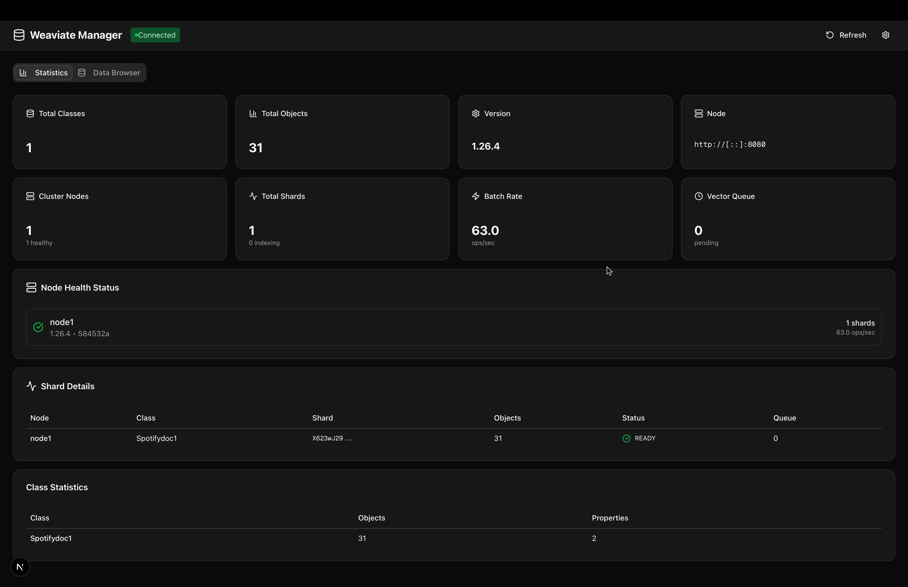
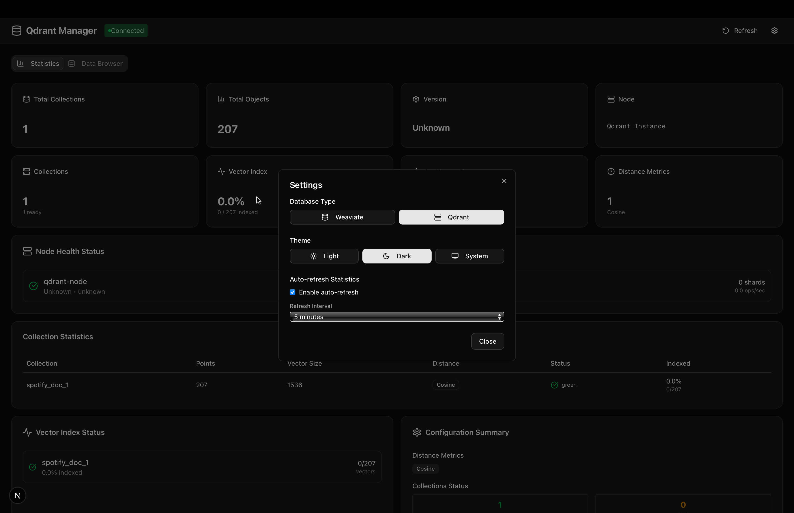

# Vector DB Manager

A modern, intuitive web-based management interface for Weaviate and Qdrant vector databases. Built with Next.js, TypeScript, and shadcn/ui.

## What it does

Vector DB Manager provides a comprehensive dashboard for managing vector databases with the following capabilities:

- **Database Management**: Switch between Weaviate and Qdrant databases
- **Collection/Class Management**: Create, view, and delete collections with custom properties
- **Object Operations**: Full CRUD operations for vector objects with bulk operations support
- **Search Functionality**: Advanced vector similarity search and text-based property search
- **Statistics Dashboard**: Real-time database metrics, cluster health monitoring, and performance tracking
- **Modern UI**: Responsive design with dark/light theme support

## Screenshots

### Weaviate Manager Dashboard



### Qdrant Manager Dashboard



## Installation

### Prerequisites

- Node.js 18+
- Weaviate or Qdrant instance (local or cloud)

### Setup

1. **Clone the repository**

   ```bash
   git clone <repository-url>
   cd w-manager
   ```

2. **Install dependencies**

   ```bash
   npm install
   ```

3. **Configure environment variables**
   Create a `.env.local` file in the root directory:

   ```env
   # For Weaviate
   WEAVIATE_URL=http://localhost:8080
   WEAVIATE_API_KEY=your-api-key-here

   # For Qdrant
   QDRANT_URL=http://localhost:6333
   QDRANT_API_KEY=your-api-key-here

   # Default database type (optional)
   DATABASE_TYPE=weaviate
   ```

4. **Run the development server**

   ```bash
   npm run dev
   ```

5. **Open your browser**
   Navigate to `http://localhost:3000`

### Production Build

```bash
npm run build
npm start
```

## Environment Variables

| Variable           | Description                                    | Default                 |
| ------------------ | ---------------------------------------------- | ----------------------- |
| `WEAVIATE_URL`     | Weaviate instance URL                          | `http://localhost:8080` |
| `WEAVIATE_API_KEY` | Weaviate API key (if authentication enabled)   | -                       |
| `QDRANT_URL`       | Qdrant instance URL                            | `http://localhost:6333` |
| `QDRANT_API_KEY`   | Qdrant API key (if authentication enabled)     | -                       |
| `DATABASE_TYPE`    | Default database type (`weaviate` or `qdrant`) | `weaviate`              |
